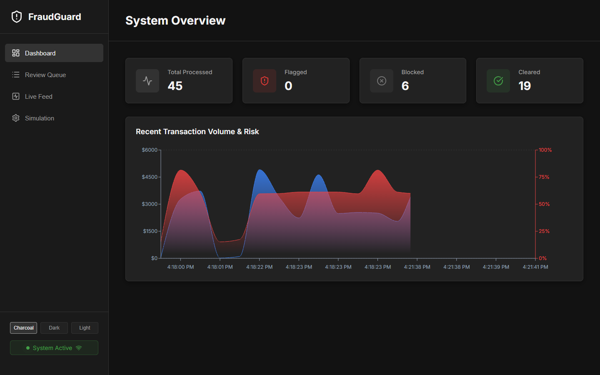
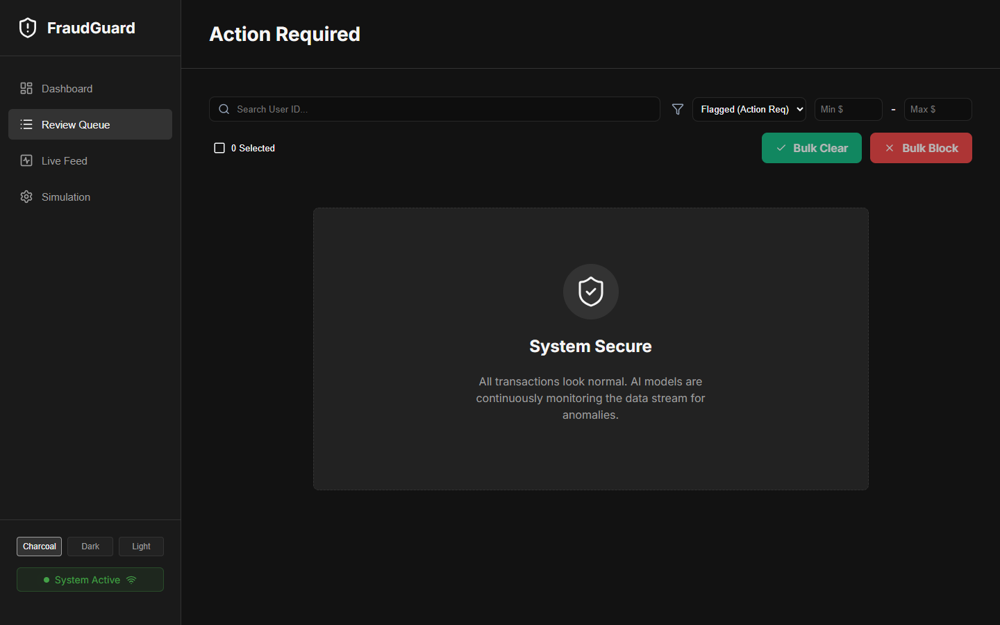
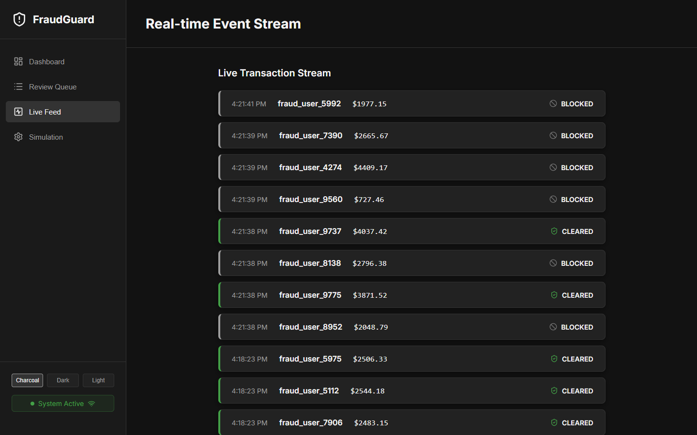
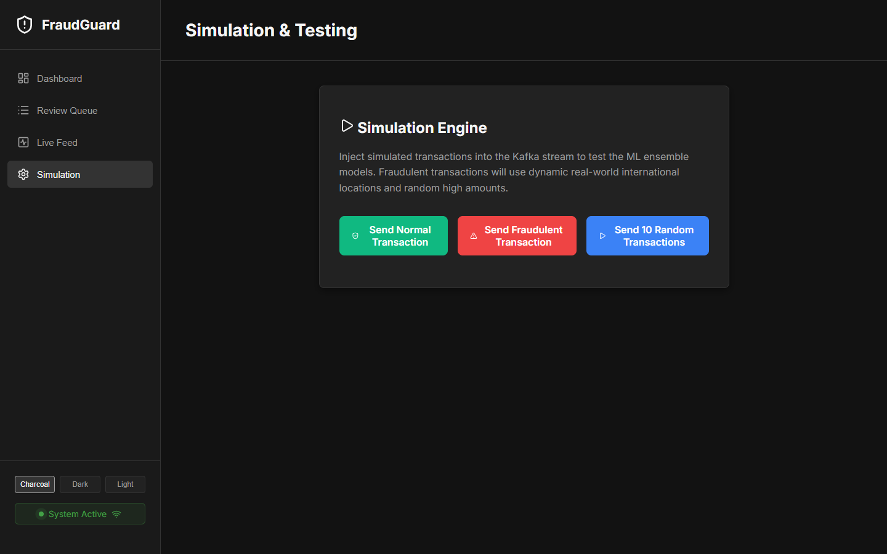

# Real-Time Fraud Detection System

**🔴 Live Demo:** [http://51.21.196.105:3000](http://51.21.196.105:3000)

A production-ready, distributed system for detecting fraudulent credit card transactions in real-time. Built with Node.js, React, Kafka, MongoDB, Redis, and PyTorch (ONNX).

##  The 25-Point Industry-Grade Upgrade
This project was rigorously refactored from a basic prototype into a highly resilient, enterprise-grade distributed system. Below are the 25 major architectural improvements implemented:

### API Server Modernization
1. **Modular Architecture:** Transitioned from a 300+ line monolith to a scalable MVC-style structure (routes, controllers, models, middleware).
2. **Structured Logging:** Replaced `console.log` with high-performance JSON structured logging using `pino`.
3. **Input Validation:** Implemented strict schema validation on all incoming requests using `zod`.
4. **Security Hardening:** Secured HTTP headers via `helmet` and implemented strict `cors` policies.
5. **ReDoS Protection:** Sanitized user inputs in MongoDB regex queries to prevent Regular Expression Denial of Service attacks.
6. **Authentication:** Added secure JWT authentication and bcrypt password hashing for analyst actions.
7. **Rate Limiting:** Added IP-based rate limiting to transaction ingress endpoints.
8. **Centralized Error Handling:** Created global error-catching middleware to prevent server crashes and leakages of stack traces in production.
9. **Fail-Fast Configuration:** Centralized environment variables with strict validation (e.g., system refuses to boot without `JWT_SECRET`).
10. **Graceful Shutdown:** Implemented SIGINT/SIGTERM handlers to safely drain HTTP requests and gracefully close MongoDB, Redis, and Kafka connections.

### Kafka Consumer Hardening
11. **At-Least-Once Guarantees:** Disabled `autoCommit` and implemented manual offset commits only *after* successful processing.
12. **Retry with Exponential Backoff:** Added robust retry logic (1s, 2s, 4s) for transient ML inference or database failures.
13. **Dead Letter Queue (DLQ):** Messages that permanently fail after retries are routed to a DLQ with rich error metadata for manual inspection.
14. **Redis Pipelining:** Grouped sequential Redis commands (`lrange`, `lpush`, `ltrim`) into atomic `.pipeline()` executions, slashing I/O latency.
15. **Runtime Stability:** Migrated from Alpine Linux to Debian-based `node:20-slim` to resolve `glibc` incompatibilities with the C++ ONNX Runtime module.

### Frontend UI/UX (Analyst Console)
16. **Centralized State Context:** Replaced chaotic, duplicate component-level polling with a unified React `DataContext` to drastically reduce network spam.
17. **Error Boundaries:** Implemented React Error Boundaries to isolate UI crashes and provide user-friendly fallback screens.
18. **Resilient API Client:** Built an API wrapper that automatically intercepts `401 Unauthorized` responses and refreshes the session token.
19. **Responsive Layouts:** Re-engineered CSS with CSS Variables and Flexbox wrapping to fully support mobile screens and prevent horizontal overflow.
20. **Clean UI Aesthetics:** Upgraded to a sleek, modern dark mode utilizing pure system colors and standard fonts, removing cluttered themes.

### Infrastructure & ML Operations
21. **9-Service Architecture:** Upgraded from 7 containers to 9, formally integrating Zookeeper and a dedicated Observability stack.
22. **Observability Stack:** Added Prometheus and Grafana for live monitoring of API latency, Kafka lag, and system health.
23. **Automated ML Pipelines:** Refactored Python ML scripts to DRY out feature engineering and automatically export `scaler.json` artifacts during training.
24. **Multi-Stage Docker Builds:** Optimized Dockerfiles with build stages, `npm install --omit=dev`, and non-root `appuser` execution for security.
25. **Container Orchestration:** Added robust Docker `HEALTHCHECK`s and dependency links so Node services automatically wait for databases to fully initialize before booting.

---

##  Features

### 1. System Overview Dashboard
Real-time system health and global metrics visualization.


### 2. Action Required (Review Queue)
Flagged transactions awaiting manual analyst review with bulk-action capabilities.


### 3. Real-Time Event Stream
Live feed of transactions streaming through the Kafka pipeline.


### 4. Simulation Engine
Inject normal and fraudulent transactions into the stream for end-to-end testing.


## Getting Started

### Prerequisites
- Docker & Docker Compose
- Node.js 20+ (for local development)
- Python 3.10+ (for retraining ML models)

### Quick Start
1. Run the boot script to auto-generate the `.env` file and start the cluster:
   ```cmd
   .\start-fresh.bat
   ```
2. Access the Analyst Console at `http://localhost:3000`.
3. View Live Metrics at `http://localhost:3001` (Grafana).

## Architecture (9-Service Cluster)
- **API Server** (`:4000`): Receives transactions, writes to DB, and publishes to Kafka.
- **Kafka Consumer** (`:4001`): Pulls events, engineers features with Redis, scores via ONNX, and updates DB.
- **Kafka & Zookeeper**: Distributed event streaming backbone.
- **MongoDB**: Persistent storage for transactions and audit logs.
- **Redis**: Low-latency feature store cache for ML time-series data.
- **Frontend** (`:3000`): React app for analysts.
- **Prometheus & Grafana** (`:9090`, `:3001`): Observability stack.

## License
MIT License
